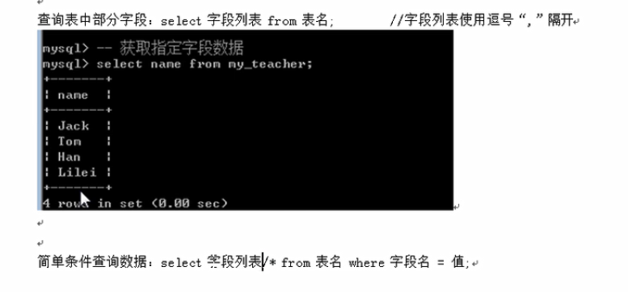
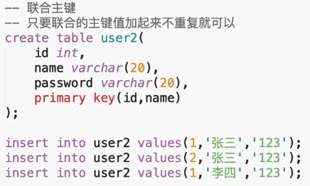
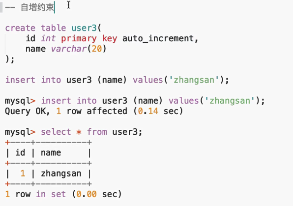
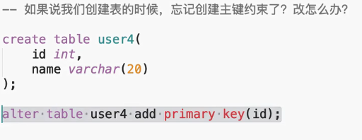
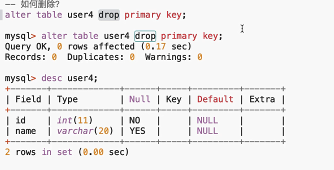
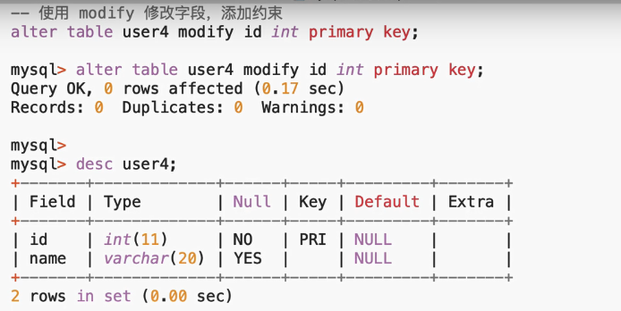
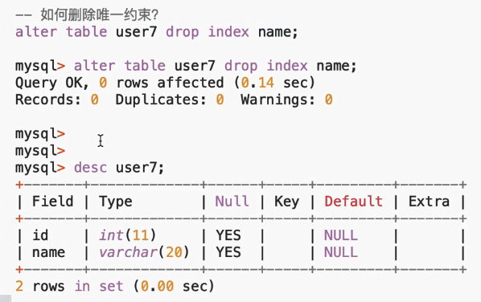
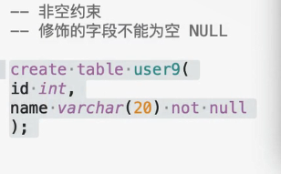
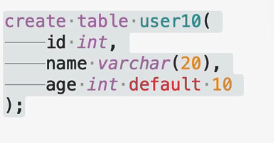
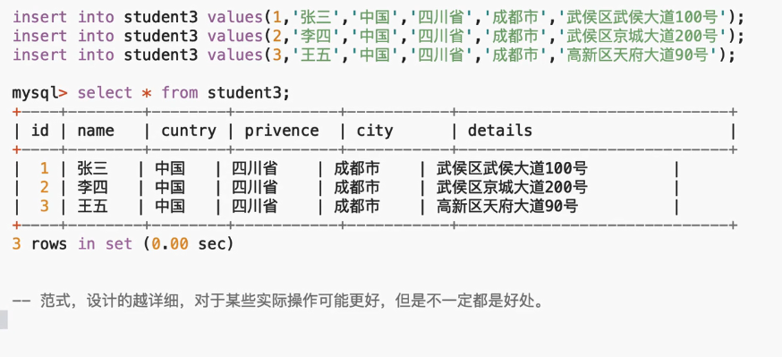

#### -- 创建数据库
create database (数据库名称)

#### -- 显示数据库
show databases (显示全部)
show databases  like(显示部分)

#### -- 选择数据库
use (数据库)
#### -- 删除数据库
drop database 数据库名字

### -- 数据表操作-------------------------------------------------------------------------------------------
 #### -- 创建数据表
#### -- 普通创建表
基本语法：create table 表名（字段名 字段类型 [字段属性],字段名 字段类型 [字段属性]...)
[表选项]

两种方式可以将表挂入制定的数据库下
1.基本语法：create table 数据库名字.表名（字段名 字段类型 [字段属性]）
2.先进入库再写

#### -- 查看表所有表
show tables
show tables  like(显示部分)

#### -- 查看表结构
desc 表名

字段名字   字段类型   值可以为控？ 索引值 默认值   额外属性
+-------+-------------+------+-----+---------+-------+
| Field | Type        | Null | Key | Default | Extra |
+-------+-------------+------+-----+---------+-------+
| name  | varchar(10) | YES  |     | NULL    |       |
+-------+-------------+------+-----+---------+-------+

#### -- 查看表创建语句
show create table 表名

#### -- 修改表选项
alter table 表明 charset gbk

（如果数据库已经有很多数据了，不要轻易修改表选项）

#### -- 修改表名称
 rename table 当前名字 to 要修改成的名字

#### --  删除表
drop table 表名称
#### --  表添加新字段----------------------------------------------
alter table 表名称 add 字段名称 int （默认后面）
alter table 表名称 add 字段名称 int first（放在最前面）

#### -- 修改字段名
alter table 表名称 change 字段名称 新字段名称 字段属性

#### -- 修改字段类型
alter table 表名称 modify 字段名称  字段属性;

#### -- 删除字段
alter table 表名称 drop 字段名称

### -- 数据操作-----------------------------------------------------------------------------------
#### -- 插入
insert into 表名字 (id,name) values(1,'lilei');

#### -- 查询
 select * from 表名字
 
 
 #### --删除数据
 

 #### --更新数据
 

## <u>主外键</u>
我们在创建数据表的时候，往往要约束某些字段。
 ### --主键约束--------------------------------------------------
    --它能够唯一确定一张表中的一条记录，也就是我们通过给某个字段添加约束，就可以使得该字段不重复且不为空。(primary key 是关键字)
1.
create table user(
    id int primary key,
    name varchar(20)
);

2.
insert into user values (1,"张三");
【ok】
insert into user values (1,"张三");
【error】

3.
insert into user values (2,"张三");
【ok】
mysql> select *from user;
+----+------+
| id | name |
+----+------+
|  1 | 张三 |
|  2 | 张三 |
+----+------+
2 rows in set (0.02 sec)
#### -- 联合主键约束
 

 #### --自增约束
 

#### -- 创建表的时候忘记主键约束了怎么办？
 

 #### --怎么删除约束
 

 ### --唯一约束
 约束修饰的字段的值不可以重复.(相比于主键约束，它可以添加多个而且值可以为空)

 #### 如何添加唯一约束
 
 #### 如何删除唯一约束
 
 ### --非空约束
 字段不能为空
 

### --默认约束
就是当我们插入字段值的时候，如果没有传值，就会使用默认值
 

## --外键约束
 -- 涉及到两个表：父表，子表
 -- 或者说是：主表，副表。
-- foreign key(class_id) references classes(id) 

 -- 班级表
 create table classes(
     id int primary key,
     name varchar(20)
 );

 -- 学生表
 create table students(
    id int primary key,
    name varchar(20),
    class_id int,
    foreign key(class_id) references classes(id)
 );

insert into classes values(1,"一班");
insert into classes values(2,"二班");
insert into classes values(3,"三班");
insert into classes values(4,"四班");

insert into students values(1001,"张三",1);
insert into students values(1002,"张三",2);
insert into students values(1003,"张三",3);
insert into students values(1004,"张三",4);
insert into students values(1005,"张三",5); （错误【1】）

1.主表 classes 中没有的数据，在副表中，是 不可以 使用的。
2.主表中的记录被副表引用，是 不可以 删除的。

# 数据库的三大设计范式。
### 1.第一范式
1nf
数据表中的所有字段都是不可分割原子值？

先创建一个叫 student2的表
create table student2(
    id int primary key,
    name varchar(20),
    address varchar(30)
);

往student2里面插入数据
insert into student2 values(1,'张三','山海关100');
insert into student2 values(2,'张三','山海关200');
insert into student2 values(3,'张三','山海关300');

          mysql> select * from student2;
          +----+------+-----------+
          | id | name | address   |
          +----+------+-----------+
          |  1 | 张三 | 山海关100 |
          |  2 | 张三 | 山海关200 |
          |  3 | 张三 | 山海关300 |
          +----+------+-----------+
          3 rows in set (0.00 sec)

像这种字段值可以继续拆分的，就不满足第一范式 （比如拆分成 山海关，100）

再创建一个表
create table student3(
    id int primary key,
    name varchar(20),
    cuntry varchar(30),
    privence varchar(30),
    city varchar(30),
    details varchar(30),
);
 

### 2.第二范式
首先要满足第一范式，除开主键以外的其他列必须完全依赖于主键，如果出现联合主键，就可能出现其他列依赖于某个主键，所以就不满足。
### 3.第三范式
首先必须要满足第二范式，除开主键列的其他列不能有传递依赖关系。。

