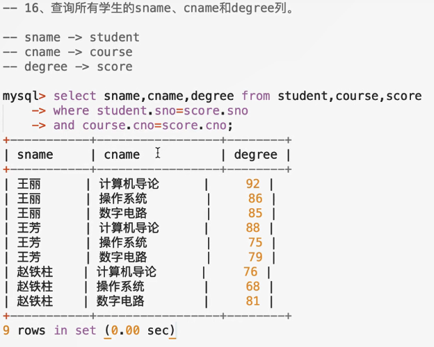
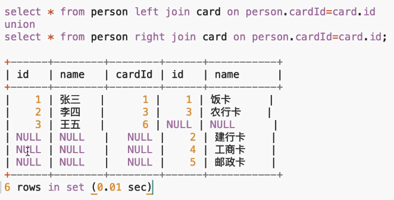

<!-- 
学生表
Student
学号
姓名
性别
出生年月日
所在班级 -->
Create table student(
    sno varchar(20) primary key,
    sname varchar(20) not null,
    ssex varchar (10) not null,
    sbirthday datetime,
    class varchar(20)
);

<!-- 
教师表
Teacher
教师编号
教师名字
教师性别
出生年月日
职称
所在部门 -->
create table teacher(
    tno varchar(20) primary key,
    tname varchar(20) not null,
    tsex varchar(10) not null,
    tbirthday datetime,
    prof varchar(20) not null,
    depart varchar(20) not null
);

<!-- 
课程表
Coures
课程号
课程名称
教室编号 -->
create table course(
    cno varchar(20) primary key,
    cname varchar(20) not null,
    tno varchar(20) not null,
    foreign key(tno) references teacher(tno)
);

<!-- 
成绩表
Score
学号
课程号
成绩 -->
create table score(
    sno varchar(20) not null,
    cno varchar(20) not null,
    degree decimal,
    foreign key(sno) references student(sno),
    foreign key(cno) references course(cno),
    primary key(sno,cno)
);

<!-- -------------------------- -->
### 往数据表中添加数据
#### 添加学生信息
insert into student values('101','曾华','男','1977-09-01','95033');
insert into student values('102','梨花','男','1977-09-24','95031');
insert into student values('103','硬汉','女','1975-05-11','95013');
insert into student values('104','老铁','男','1977-09-01','95033');
insert into student values('105','张全蛋','女','1975-04-01','95031');
insert into student values('106','王尼玛','男','1976-09-36','95031');
insert into student values('107','赵铁柱','女','19776-09-01','95033');
insert into student values('108','张飞','女','1977-12-01','95033');
insert into student values('109','吕布','男','1977-1-21','95013');

#### 添加教师表
insert into teacher values('804','李诚','男','1958-12-02','副教授','计算机系');
insert into teacher values('856','张旭','男','1969-03-12','讲师','电子工程系');
insert into teacher values('825','王萍','女','1972-05-05','助教','计算机系');
insert into teacher values('831','刘冰','女','1977-08-14','助教','电子工程系');

#### 添加课程表
insert into course values("3-105","计算机导论","825");
insert into course values("3-245","操作系统","804");
insert into course values("6-166","数字电路","856");
insert into course values("9-888","高等数学","831");

#### 添加成绩表
insert into score values('103','3-245','86');
insert into score values('105','3-
245','75');
insert into score values('109','3-245','68');
insert into score values('103','3-105','92');
insert into score values('105','3-105','88');
insert into score values('109','3-105','76');
insert into score values('103','6-166','85');
insert into score values('105','6-166','79');
insert into score values('109','6-166','81');

# 查询练习

### 1.查询student表的所有记录
mysql> select * from student;
+-----+--------+------+---------------------+-------+
| sno | sname  | ssex | sbirthday           | class |
+-----+--------+------+---------------------+-------+
| 101 | 曾华   | 男   | 1977-09-01 00:00:00 | 95033 |
| 102 | 梨花   | 男   | 1977-09-24 00:00:00 | 95031 |
| 103 | 硬汉   | 女   | 1975-05-11 00:00:00 | 95013 |
| 104 | 老铁   | 男   | 1977-09-01 00:00:00 | 95033 |
| 105 | 张全蛋 | 女   | 1975-04-01 00:00:00 | 95031 |
| 108 | 张飞   | 女   | 1977-12-01 00:00:00 | 95033 |
| 109 | 吕布   | 男   | 1977-01-21 00:00:00 | 95013 |
+-----+--------+------+---------------------+-------+
7 rows in set (0.03 sec)

### 2.查询student表中的所有记录的 sname ssex 和 class 列
mysql> select sname,ssex,class from student;
+--------+------+-------+
| sname  | ssex | class |
+--------+------+-------+
| 曾华   | 男   | 95033 |
| 梨花   | 男   | 95031 |
| 硬汉   | 女   | 95013 |
| 老铁   | 男   | 95033 |
| 张全蛋 | 女   | 95031 |
| 张飞   | 女   | 95033 |
| 吕布   | 男   | 95013 |
+--------+------+-------+
7 rows in set (0.00 sec)

### 3.查询教师所有的单位及不重复的depart列
//--distinct 排除重复

mysql> select distinct depart from teacher;
+------------+
| depart     |
+------------+
| 计算机系   |
| 电子工程系 |
+------------+
2 rows in set (0.00 sec)
### 4.查询score表中成绩在60-80之间的所有记录
//--查询区间where ... between ... and ...

mysql> select * from score where degree between 60 and 80;
mysql> select * from score where degree > 60 and degree < 80;
+-----+-------+--------+
| sno | cno   | degree |
+-----+-------+--------+
| 105 | 3-245 |     75 |
| 105 | 6-166 |     79 |
| 109 | 3-105 |     76 |
| 109 | 3-245 |     68 |
+-----+-------+--------+
4 rows in set (0.01 sec)

### 5.查询score表中成绩在85,86,88的记录
//--表示 同字段 或者关系的查询 in

mysql> select * from score where degree in(85,86,88);
+-----+-------+--------+
| sno | cno   | degree |
+-----+-------+--------+
| 103 | 3-245 |     86 |
| 103 | 6-166 |     85 |
| 105 | 3-105 |     88 |
+-----+-------+--------+
3 rows in set (0.00 sec)
 

### 6.查询student 表中 "95031"班或性别为"女"的同学记录.
//--表示 不同字段 或者关系的查询 or

select * from student where class='95031' or ssex='女';

mysql> select * from student where class='95031' or ssex='女';
+-----+--------+------+---------------------+-------+
| sno | sname  | ssex | sbirthday           | class |
+-----+--------+------+---------------------+-------+
| 102 | 梨花   | 男   | 1977-09-24 00:00:00 | 95031 |
| 103 | 硬汉   | 女   | 1975-05-11 00:00:00 | 95013 |
| 105 | 张全蛋 | 女   | 1975-04-01 00:00:00 | 95031 |
| 108 | 张飞   | 女   | 1977-12-01 00:00:00 | 95033 |
+-----+--------+------+---------------------+-------+
4 rows in set (0.00 sec)

### 7.以class降序查询student表的所有记录
--升序 , 降序
  -asc   -desc

mysql> select * from student order by class desc;
+-----+--------+------+---------------------+-------+
| sno | sname  | ssex | sbirthday           | class |
+-----+--------+------+---------------------+-------+
| 101 | 曾华   | 男   | 1977-09-01 00:00:00 | 95033 |
| 104 | 老铁   | 男   | 1977-09-01 00:00:00 | 95033 |
| 108 | 张飞   | 女   | 1977-12-01 00:00:00 | 95033 |
| 102 | 梨花   | 男   | 1977-09-24 00:00:00 | 95031 |
| 105 | 张全蛋 | 女   | 1975-04-01 00:00:00 | 95031 |
| 103 | 硬汉   | 女   | 1975-05-11 00:00:00 | 95013 |
| 109 | 吕布   | 男   | 1977-01-21 00:00:00 | 95013 |
+-----+--------+------+---------------------+-------+
7 rows in set (0.00 sec)

### 8.以con升序、degree降序查询score表的所有记录

mysql> select * from score order by cno asc,degree desc;
+-----+-------+--------+
| sno | cno   | degree |
+-----+-------+--------+
| 103 | 3-105 |     92 |
| 105 | 3-105 |     88 |
| 109 | 3-105 |     76 |
| 103 | 3-245 |     86 |
| 105 | 3-245 |     75 |
| 109 | 3-245 |     68 |
| 103 | 6-166 |     85 |
| 109 | 6-166 |     81 |
| 105 | 6-166 |     79 |
+-----+-------+--------+
9 rows in set (0.00 sec)

### 9.查询“95831”班的学生人数
--统计 count
mysql> select count(*) from student where class="95031";
+----------+
| count(*) |
+----------+
|        2 |
+----------+
1 row in set (0.00 sec)

### 10.查询score表中的最高分学生学号和课程号
mysql> select  sno,cno from score where degree=(select max(degree) from score);
+-----+-------+
| sno | cno   |
+-----+-------+
| 103 | 3-105 |
+-----+-------+
1 row in set (0.02 sec)

##### 1.找到最高分
select max(degree) from score;
##### 2.找到最高分的 sno和 cno
mysql> select  sno,cno from score where degree=(select max(degree) from score);

#####（如果同时有两个最高分，需要用到排序做法)
--order by
select sno,cno,degree from score order by degree;

mysql> select sno,cno,degree from score order by degree;
+-----+-------+--------+
| sno | cno   | degree |
+-----+-------+--------+
| 109 | 3-245 |     68 |
| 105 | 3-245 |     75 |
| 109 | 3-105 |     76 |
| 105 | 6-166 |     79 |
| 109 | 6-166 |     81 |
| 103 | 6-166 |     85 |
| 103 | 3-245 |     86 |
| 105 | 3-105 |     88 |
| 103 | 3-105 |     92 |
+-----+-------+--------+
9 rows in set (0.00 sec)

-- select sno,cno,degree from score order by degree desc limit 0,1;
-  limit 第一个数字表示从多少开始，第二个数字表示查多少条
mysql> select sno,cno,degree from score order by degree desc limit 0,1;
+-----+-------+--------+
| sno | cno   | degree |
+-----+-------+--------+
| 103 | 3-105 |     92 |
+-----+-------+--------+
1 row in set (0.00 sec)

### 11.查询每门课的平均成绩
avg(degree)
mysql> select degree from score where cno="3-105";
+-------------+
| avg(degree) |
+-------------+
|     85.3333 |
+-------------+
1 row in set (0.01 sec)

- 在一个sql语句查询多个。
-- group by 分组

select cno,avg(degree) from score group by cno;
mysql> select cno,avg(degree) from score group by cno;
+-------+-------------+
| cno   | avg(degree) |
+-------+-------------+
| 3-105 |     85.3333 |
| 3-245 |     76.3333 |
| 6-166 |     81.6667 |
+-------+-------------+
3 rows in set (0.00 sec)

# 多表联查
mysql> select sname,cno,degree from student,score
    -> where student.sno=score.sno;
+--------+-------+--------+
| sname  | cno   | degree |
+--------+-------+--------+
| 硬汉   | 3-105 |     92 |
| 硬汉   | 3-245 |     86 |
| 硬汉   | 6-166 |     85 |
| 张全蛋 | 3-105 |     88 |
| 张全蛋 | 3-245 |     75 |
| 张全蛋 | 6-166 |     79 |
| 吕布   | 3-105 |     76 |
| 吕布   | 3-245 |     68 |
| 吕布   | 6-166 |     81 |
+--------+-------+--------+

### 多表联查三张表
 

# SQL的四种连接查询！
内连接
inner join 或者 join

外连接
1.左连接 left join 或者 left outer join

2.右连接 right join 或者 right outer join

3.完全外连接 full join 或者 full outer join

-----------------------------------------
###### 创建两个表
create database testJoin;

person 表
id,
name,
cariId

create table person(
    id int,
    name varchar(20),
    cardId int
);

card 表
id,
name

create table card(
    id int,
    name varchar(20)
);

----插入数据
insert into card values(1,'饭卡'); 
insert into card values(2,'建行卡');
insert into card values(3,'农行卡');
insert into card values(4,'工商卡');
insert into card values(5,'邮政卡');

insert into person values(1,'张三','1');
insert into person values(2,'张三','3');
insert into person values(3,'张三','6');

--- 并没有创建外键

### --inner jion

mysql> select * from person join card on person.cardId=card.id;
+------+------+--------+------+--------+
| id   | name | cardId | id   | name   |
+------+------+--------+------+--------+
|    1 | 张三 |      1 |    1 | 饭卡   |
|    2 | 张三 |      3 |    3 | 农行卡 |
+------+------+--------+------+--------+
2 rows in set (0.00 sec)

-- 内联查询，其实就是两张表中的数据，通过某个字段相对，查询出相关记录数据。

### --left jion （左外连接）

mysql> select * from person left join card on person.cardId=card.id;
+------+------+--------+------+--------+
| id   | name | cardId | id   | name   |
+------+------+--------+------+--------+
|    1 | 张三 |      1 |    1 | 饭卡   |
|    2 | 张三 |      3 |    3 | 农行卡 |
|    3 | 张三 |      6 | NULL | NULL   |
+------+------+--------+------+--------+
3 rows in set (0.00 sec)

--左外连接，会把左边的表里面所有的数据取出来，而右边表中的数据，如果有相等的，就显示出来，如果没有，就会补null

### --right jion （右外连接）

mysql> select * from person right join card on person.cardId=card.id;
+------+------+--------+------+--------+
| id   | name | cardId | id   | name   |
+------+------+--------+------+--------+
|    1 | 张三 |      1 |    1 | 饭卡   |
|    2 | 张三 |      3 |    3 | 农行卡 |
| NULL | NULL |   NULL |    2 | 建行卡 |
| NULL | NULL |   NULL |    4 | 工商卡 |
| NULL | NULL |   NULL |    5 | 邮政卡 |
+------+------+--------+------+--------+
5 rows in set (0.01 sec)

--右外连接，会把右边的表里面所有的数据取出来，而左边表中的数据，如果有相等的，就显示出来，如果没有，就会补null

### --full jion （全外连接）
select * from person full join card on person.cardId=card.id

mysql 不支持 full join
 
